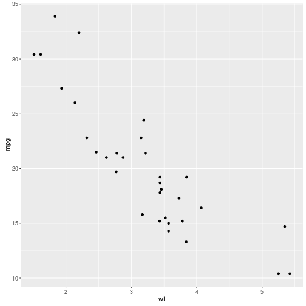

# Quantitative Genetics

<small>
Instructor: [A Augusto F Garcia](http://about.me/augusto.garcia)
/ [Statistical Genetics Lab](http://statgen.esalq.usp.br) </small>

<small>Department of Genetics, Luiz de Queiroz College of Agriculture,
University of São Paulo (Brazil)</small>

<script src="http://ajax.googleapis.com/ajax/libs/jquery/1.9.1/jquery.min.js"></script>

*** =pnotes

Some notes on the first slide

---

## Contents


<section>

---

### Slide 1

---

### Slide 2

</section>

--- &vertical

## Vertical Slides

Slides can be nested inside of other slides, try pressing <a href="#" class="navigate-down">down</a>

<a href="#" class="image navigate-down">
  
</a>

***

## Basement Level 1

Press down or up to navigate.

***

## Basement Level 2

Cornify

<a class="test" href="http://cornify.com">
 
</a>

***

## Basement Level 3

That's it, time to go back up.

<a href="#/2" class="image">
  
</a>

--- &vertical

## Vertical Slides

Slides can be nested inside of other slides, try pressing <a href="#" class="navigate-down">down</a>

<a href="#" class="image navigate-down">
  
</a>

***

## Basement Level 1

Press down or up to navigate.

***

## Basement Level 2

Cornify

---

## Point of View

Press ESC to enter the slide overview. Hold down alt and click on any element to zoom in on it using [zoom.js](http://lab.hakim.se/zoom-js). Alt + click anywhere to zoom back out.

---

## RVL.IO

If you don't like writing slides in HTML you can use the online editor [rvl.io](http://rvl.io).

---

## Works in Mobile Safari

Try it out! You can swipe through the slides and pinch your way to the overview.

---

## Marvolous Unordered List

- No order here
- Or here
- Or here
- Or here

---

## Fantastic Ordered List

1. One is smaller than...
2. Two is smaller than...
3. Three!

--- #transitions

## TRANSITION STYLES
You can select from different transitions, like: 

[Cube](?transition=cube#/transitions) - [Page](?transition=page#/transitions) - [Concave](?transition=concave#/transitions) - [Zoom](?transition=zoom#/transitions) - [Linear](?transition=linear#/transitions) - [Fade](?transition=fade#/transitions) - [None](?transition=none#/transitions) - [Default](?transition=default#/transitions)

--- #themes

## Themes

Reveal.js comes with a few themes built in: 

[Sky](?theme=sky#/themes) - [Beige](?theme=beige#/themes) - [Simple](?theme=simple#/themes) - [Serif](?theme=serif#/themes) - [Night](?theme=night#/themes) - [Default](?theme=default#/themes) - [Solarized](?theme=solarized#/themes) - [Moon](?theme=moon#/themes)

<small>* Theme demos are loaded after the presentation which leads to flicker. In production you should load your theme in the `<head>` using a `<link>`.</small>

--- ds:alert &vertical

## Global State
Set `data-state="something"` on a slide and "something" will be added as a class to the document element when the slide is open. This lets you apply broader style changes, like switching the background.

<a href="#" class="image navigate-down">
  
</a>

*** ds:blackout

## Blackout

<a href="#" class="image navigate-down">
  
</a>

*** ds:soothe

## Soothe

<a href="#" class="image navigate-next">
  
</a>

--- ds:red &vertical

## Custom Soothe Styles

*** ds:orange

## Orange

*** ds:yellow

## Yellow

*** ds:green

## Green

*** ds:blue

## Blue

*** ds:indigo

## Indigo

*** ds:violet

## Violet

*** ds:brown

## Brown

---

## Custom Events

Additionally custom events can be triggered on a per slide basis by binding to the data-state name.

```
Reveal.addEventListener( 'customevent', function() {
  console.log( '"customevent" has fired' );
} );
```

---

## Clever Quotes

These guys come in two forms, inline:  <q>The nice thing about standards is that there are so many to choose from and block:</q>

> For years there has been a theory that millions of monkeys typing at random on millions of typewriters would reproduce the entire works of Shakespeare. The Internet has proven this theory to be untrue.

---

## Pretty Code

```
function linkify( selector ) {
  if( supports3DTransforms ) {

    var nodes = document.querySelectorAll( selector );

    for( var i = 0, len = nodes.length; i < len; i++ ) {
      var node = nodes[i];

      if( !node.className ) ) {
        node.className += ' roll';
      }
    };
  }
}
```

Courtesy of [highlight.js](http://softwaremaniacs.org/soft/highlight/en/description/)

---

## Intergalactic Interconnections

You can link between slides internally, [like this](#/2/3).

---

## Fragmented Views

Hit the next arrow...

.fragment ... to step through ...

> - any type
> - of view
> - __fragments__

---

## Take a Moment

Press b or period on your keyboard to enter the 'paused' mode. This mode is helpful when you want to take distracting slides off the screen during a presentation.


---

## Incremental Paragraphs

.fragment This is paragraph 1 and should appear on first click.

.fragment This is paragraph 2 and should appear on second click.

.small [Back to the Beginning](#/0)


---

## Title

This is a slide

- point 1
- point 2
- point 3

---

## Incremental Reveal

These points should be animated

> - Point 1
> - .highlight-red Point 2
> - .grow Point 3

<script>
$('ul.incremental li').addClass('fragment')
</script>


---

## Code with slide


```r
library(ggplot2)
qplot(wt, mpg, data = mtcars)
```



--- &vertical ds:soothe

## Vertical Slides

The next set of slides will be vertical slides.

***

## Slide 1

This is slide 1

***

## Slide 2

<iframe src='http://www.statdistributions.com' width = '960px' height = '600px'></iframe>

